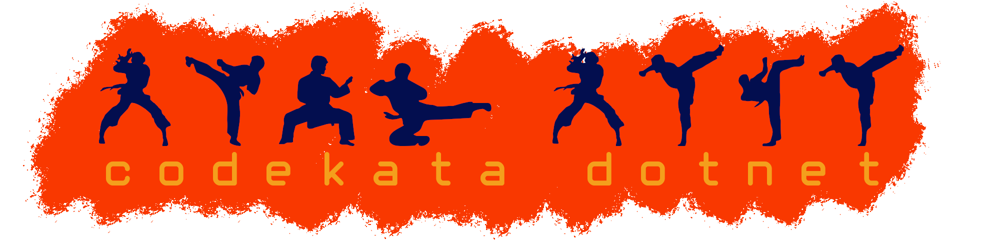

    

# **What is a Code Kata?**

* A practical exercise in programming that helps you improve your abilities through repetition.
* Code Katas are typically constructed as a succession of failed unit tests.

You have to get them to pass.

 

I hear and I forget.  
I see and I remember.  
I do and I understand.  
<b>-- Confucius</b>

## Kata

* [Fibonacci Kata](./kata/fibonacci) - Practice and learn

## Other Katas

## What you will need to build the katas
1. 

Code Kata in dotnet with C# language.
